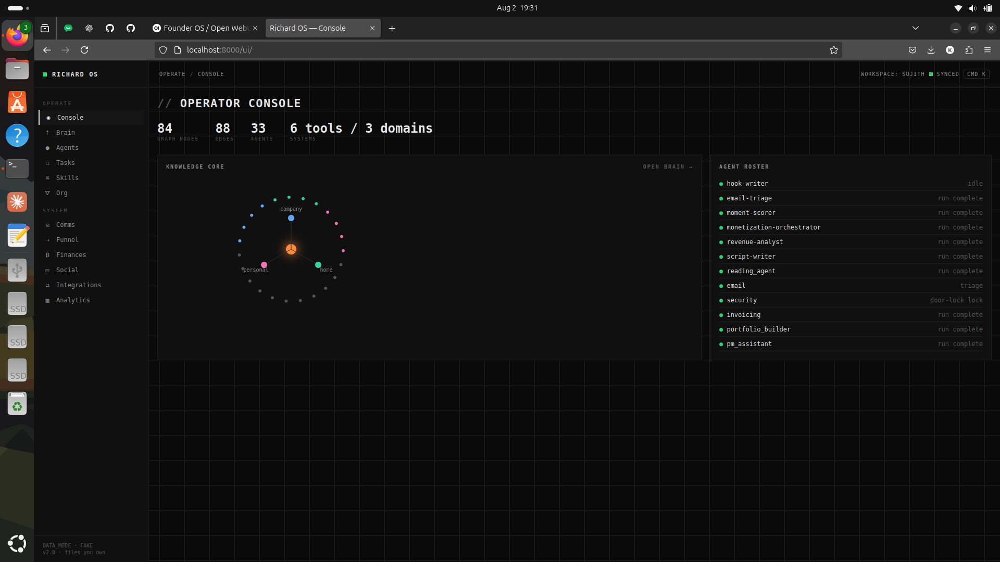
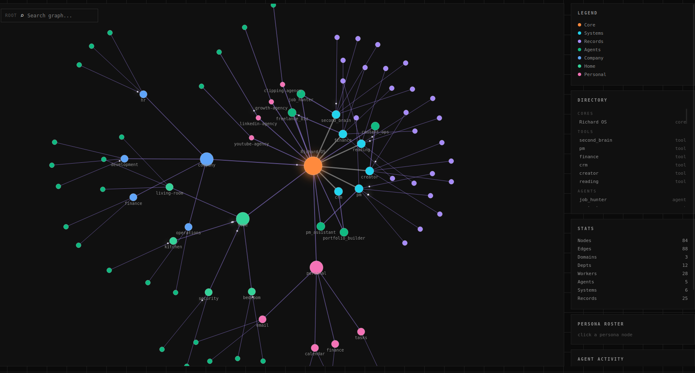
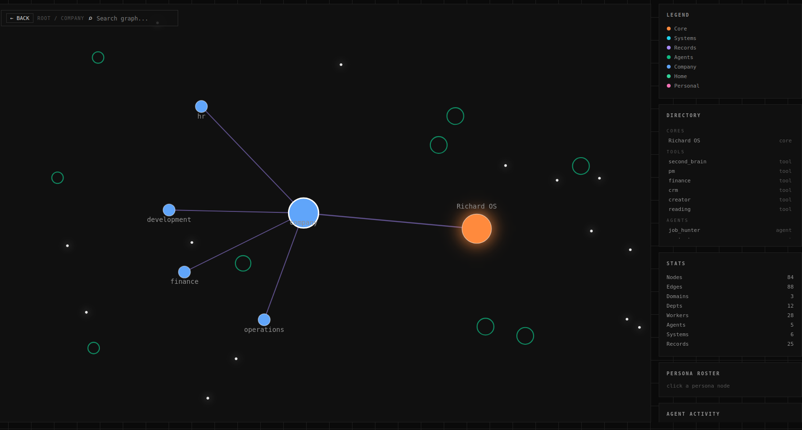
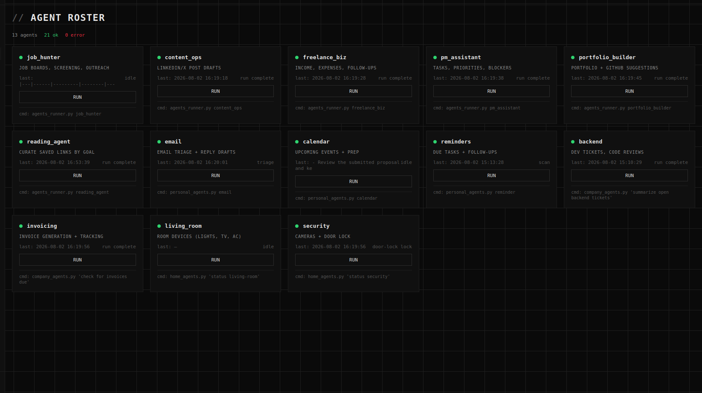
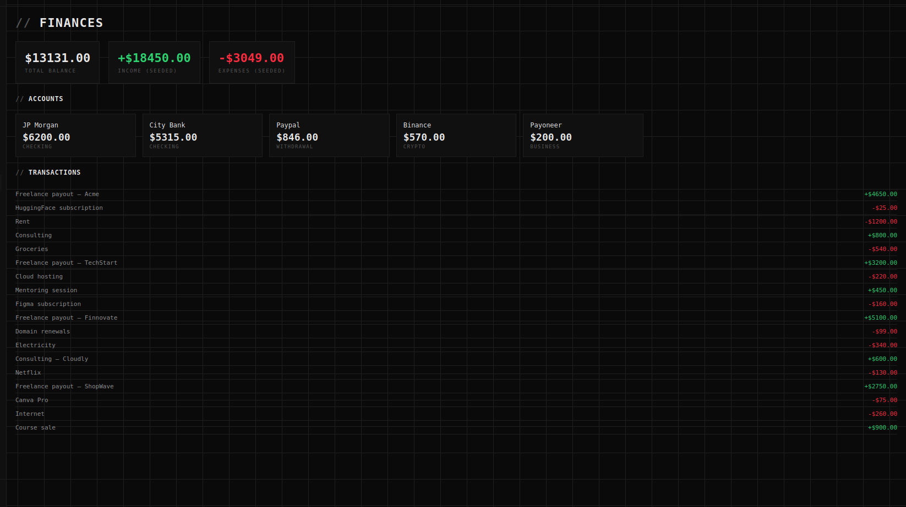
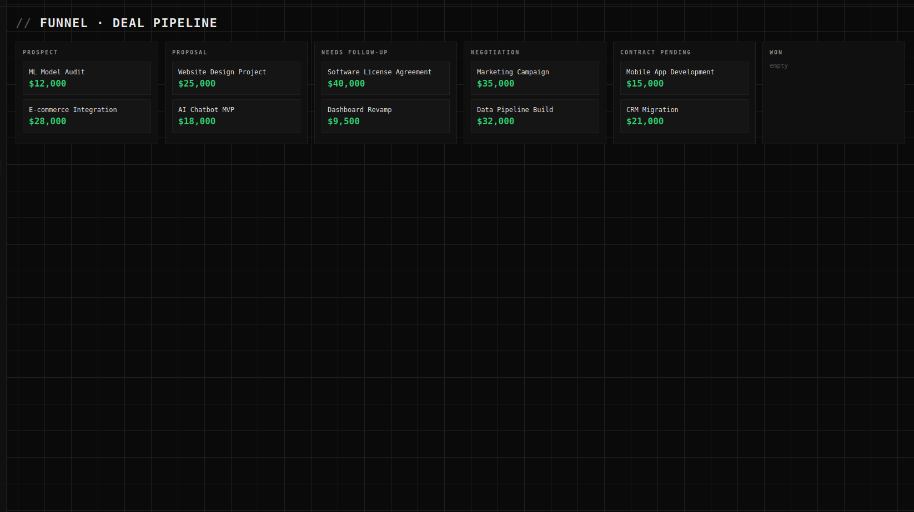
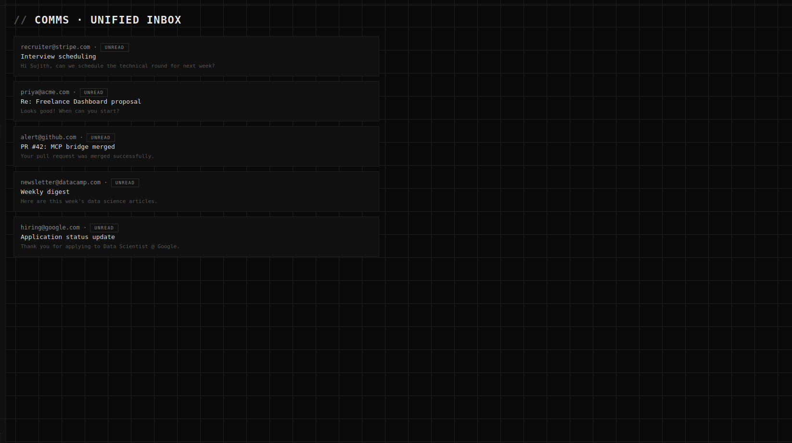
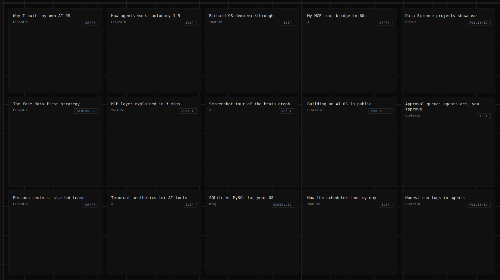

# Richard OS


A personal AI operating system: memory, tools, agents, and skills in one folder your AI runs.
Built by Sujith Richard. Free. Files you own outright — no subscription.

## What it is
- 5 systems of record: second brain, PM, finance, CRM, creator (SQLite)
- Agents with honest run logs: job_hunter, content_ops, freelance_biz, pm_assistant, portfolio_builder
- 5 skills: outreach, resume_tailor, invoice, linkedin_post, job_screen
- Scheduler: agents run on a schedule while you sleep
- Knowledge-graph UI: a live map of everything your OS knows

## v2.0 — Domains, Approval & Live Graph
- **Super-Orchestrator**: routes plain-English requests to company/home/personal trees (`scripts/orchestrator.py`)
- **Company hierarchy**: HR (recruiter/payroll/onboarding), Dev (backend/frontend/tester), Finance (invoicing/expense), Ops (fulfillment/support) — `scripts/company_agents.py`
- **Home control**: room-wise device agents (simulated, Home Assistant-ready) — `scripts/home_agents.py`
- **Personal assistant**: email triage, calendar, reminders — `scripts/personal_agents.py`
- **MCP layer**: web, weather, GitHub, email tools — `tools/mcp_bridge.py`
- **Approval queue**: autonomy-2 drafts (email, invoices, outreach) queue for one-click approve — `scripts/approval_queue.py`
- **Fake-data-first**: `DATA_MODE=fake` in `.env`; seed with `python scripts/seed_data.py`
- **Knowledge graph v2**: zoom/pan, hover-glow of connections, click-to-drill with back button, live agent pulse

## Cross-platform CI
GitHub Actions verifies boot + DB init + seed + CLI smoke on Linux/Windows/macOS.

## Quickstart
```bash
git clone https://github.com/Sujith-richard/richard-os.git
cd richard-os
python3 -m venv .venv
source .venv/bin/activate
pip install -r requirements.txt
cp .env.example .env
python3 scripts/init_db.py
python3 scripts/seed_data.py
python3 run.py
## Approval queue
```bash
python3 scripts/approval_queue.py list
python3 scripts/approval_queue.py approve 1
## Knowledge-graph UI
```bash
python3 -m uvicorn scripts.server:app --reload --port 8000
# open http://localhost:8000/ui/
## Structure
01-root-spine/ system, encoding, invariants, config
02-blocks/ departments (company/home/personal trees)
03-agents/ named workers + logs
04-skills/ repeatable moves
05-systems-of-record/ CRM, finance, PM, content, second brain
06-data/ SQLite DBs
07-schedules/ scheduler + briefs
scripts/ CLI, agents, orchestrator, server
tools/ MCP bridge + home bridge
ui/ knowledge-graph front-end

## Autonomy levels
1 Lookup · 2 Recommend · 3 Act & spot-check · 4 Runs independently · 5 Self-monitoring
Set per agent in `01-root-spine/company.yaml`.
## Screenshots









## v3.0 — Full command center
- Sidebar v2 (18 views) + 8 themes + ⌘K palette
- Executive mission-control dashboard (stats + charts + AI feed)
- Communications (7 channel tabs, sentiment, AI summary, suggested replies)
- Funnel 7-stage kanban + KPIs + conversion chart
- Social + Content analytics (reach, likes, SEO score, reading time)
- Finance (MRR, ARR, runway, cash-flow chart)
- Agents roster v2 (confidence, memory, runs, Run/Logs)
- Integrations honest board (never fakes connectivity)
- Analytics suite (9 charts: revenue, funnel, radar, heatmap, sparklines)
- Tasks v2 + Skills library + Org tree + Workflows builder
- Roadmap + Reference + Personas roster pages

## Screenshots


## v3.0 — Full command center
- Sidebar v2 (18 views) + 8 themes + ⌘K palette
- Executive mission-control dashboard (stats + charts + AI feed)
- Communications (7 channel tabs, sentiment, AI summary, suggested replies)
- Funnel 7-stage kanban + KPIs + conversion chart
- Social + Content analytics (reach, likes, SEO score, reading time)
- Finance (MRR, ARR, runway, cash-flow chart)
- Agents roster v2 (confidence, memory, runs, Run/Logs)
- Integrations honest board (never fakes connectivity)
- Analytics suite (9 charts: revenue, funnel, radar, heatmap, sparklines)
- Tasks v2 + Skills library + Org tree + Workflows builder
- Roadmap + Reference + Personas roster pages

## Screenshots


## v3.0 — Full command center
- Sidebar v2 (18 views) + 8 themes + ⌘K palette
- Executive mission-control dashboard (stats + charts + AI feed)
- Communications (7 channel tabs, sentiment, AI summary, suggested replies)
- Funnel 7-stage kanban + KPIs + conversion chart
- Social + Content analytics (reach, likes, SEO score, reading time)
- Finance (MRR, ARR, runway, cash-flow chart)
- Agents roster v2 (confidence, memory, runs, Run/Logs)
- Integrations honest board (never fakes connectivity)
- Analytics suite (9 charts: revenue, funnel, radar, heatmap, sparklines)
- Tasks v2 + Skills library + Org tree + Workflows builder
- Roadmap + Reference + Personas roster pages

## Screenshots


## v3.3.0 — Project Generation Engine (#15)
Turn a plain-English brief into a delivered, scored project scaffold.

- **Pipeline:** brief-intake → route → scaffold → review-fix → security → quality → package → deliver → learning
- **Routing:** word-boundary keyword match → frontend / backend / fullstack (web-dev.yaml)
- **Scaffolding:** React+Vite, FastAPI, or fullstack docker-compose trees in `06-data/generated_projects/`
- **Gates:** review-fix loop (max 3 iters) · security scan · quality score (≥80%)
- **Delivery:** `.zip` archive + `delivery_manifest.json` per project
- **Learning engine:** repeatable lessons auto-promote (count ≥3 → skill)
- **API:** `POST /api/v1/project/generate` · `GET /api/v1/project/status/{id}` · `GET /api/v1/project/list`
- **UI:** `ui/project-gen.html` — stage chips, file tree, learning log, history
- **Dept block:** `02-blocks/company/web-dev.yaml`

## v3.5.0 — Live Integrations Hub (real-data swap, UI-driven)
Flip any data source from seeded FAKE to real LIVE — from the browser, no .env edits.

- **Sources:** GitHub (public API), Gmail (IMAP app-password), Weather (Open-Meteo), Home Assistant (REST), AI Models (AI-Workspace proxy)
- **Per-source status:** fake → unconfigured → live/error · LIVE/DEMO pill in every shell topbar
- **UI:** `ui/integrations.html` — cards with badges, config fields, Test / Sync / mode toggle
- **API:** `GET /api/v1/integrations` · `POST .../test|sync|mode|config`
- **Swap:** consumers read `live_*.json` when live, seeded DBs when fake (no logic rewrites)
- **Secrets:** config lives in `06-data/integrations.json` (gitignored, stays local)

## v3.19.0 — Department Layer (#14)
Every department is now a real, self-contained unit with a full 16-item spine.

- **Spec:** `02-blocks/company/departments-spec.yaml` — 8 depts (web, ai, data, cyber, cloud, robotics, finance, hr): lead, specialists, skills, stacks, autonomy, decision rules, workflows, datasets
- **Engine:** `scripts/department_engine.py` scaffolds each dept folder: knowledge/skills/agents/prompts/templates/standards/rules/workflows/docs/git/mcp/memory/datasets/training (15 files each)
- **API:** `GET /api/v1/departments` · `GET /api/v1/departments/{name}` · `GET .../{name}/file?path=` · `POST /api/v1/departments/generate`
- **UI:** `ui/departments.html` — dept cards → spine explorer → file viewer
- **Org tree** now reads the live spec (was 19 hardcoded, now spec-driven)

## v3.20.0 — Planner AI + Workflow Engine (#10)
Goals become runnable workflows — real state machines, not static cards.

- **Planner AI:** `scripts/planner.py` turns a goal into a step plan (trigger/agent/data/approve/action)
- **Workflow Engine:** `scripts/workflow_engine.py` executes workflows step-by-step, tracks status (idle/running/done/error), persists runs + step logs to `06-data/workflows.db`
- **API:** `GET /api/v1/workflows` · `GET /{name}` · `POST /plan` · `POST /{name}/run` · `POST /seed`
- **UI:** `ui/workflows.html` — live workflows with real status/runs, RUN button + step log, Planner AI input (goal → plan)
- **Honest status:** `/workflow-status` now reads the DB (was hardcoded fake)

## v3.21.0 — Continuous Learning (#16)
The feedback loop: capture → dataset → fine-tune → improve core.

- **Capture:** run logs + project learnings + workflow runs → samples/lessons (`scripts/learning_engine.py`)
- **Dataset:** generate JSONL training set (instruction/input/output) → `06-data/datasets/`
- **Fine-tune:** mark a model fine-tuned on the dataset (fake-first; real hook via models integration)
- **Improve core:** repeated lessons (count ≥ 3) auto-promoted into `04-skills/`
- **API:** `GET /api/v1/learning/overview` · `POST /capture` · `POST /dataset/generate` · `POST /fine-tune` · `POST /improve-core`
- **UI:** `ui/learning.html` — 4-stage loop with Run buttons + top lessons

## v3.22.0 — Neural Collaboration (#17)
Agents share through the graph, not point-to-point.

- **Shared bus:** `scripts/collab_engine.py` — 27 agents (core engines + company + personal + persona), send/read messages, validate each other, edge stats
- **Live edges:** `06-data/collab.db` edges table — message counts + last activity per sender→recipient
- **API:** `GET /api/v1/collab/graph` · `GET /agents` · `POST /message` · `GET /inbox/{agent}` · `POST /validate`
- **UI:** `ui/collab.html` — live collaboration edges, message composer, validation, agent inbox

## v3.22.0 — Neural Collaboration (#17)
Agents share through the graph, not point-to-point.

- **Shared bus:** `scripts/collab_engine.py` — 27 agents (core engines + company + personal + persona), send/read messages, validate each other, edge stats
- **Live edges:** `06-data/collab.db` edges table — message counts + last activity per sender→recipient
- **API:** `GET /api/v1/collab/graph` · `GET /agents` · `POST /message` · `GET /inbox/{agent}` · `POST /validate`
- **UI:** `ui/collab.html` — live collaboration edges, message composer, validation, agent inbox

## v3.23.0 — Doc Chat + Vision (#18)
Upload a document — then ask questions grounded in it.

- **Doc-chat:** `scripts/doc_chat.py` — PDF text extraction (pypdf), text upload, chunking + lexical search, grounded Q&A via `agent_lib.call_llm`
- **Vision:** image upload → base64 → Model Orchestrator routing (gemini-3.5-flash → gpt-oss-120b → default), honest fallback if no vision-capable model
- **API:** `POST /api/v1/docchat/upload` (multipart) · `POST /ask` · `GET /docs` · `GET /messages/{id}`
- **UI:** `ui/docchat.html` — upload zone, doc picker, chat thread with source chunks

## v3.24.0 — Personal Life Trackers (#19) — FINAL LAYER
Health · Travel · Shopping systems of record, alongside email/tasks/calendar/smart-home.

- **Life agents:** `scripts/life_agents.py` — health (workout/steps/sleep), trips (planned with budget), shopping (open/bought), seeded fake-first
- **API:** `GET /api/v1/life/overview` · `GET /health|trips|shopping` · `POST /health/add|trip/add|shopping/add|shopping/toggle`
- **UI:** `ui/life.html` — 3 tracker cards with add-forms + lists
- **Collab:** health-agent / travel-agent / shopping-agent added to the Neural Collaboration roster (30 agents)

## v3.25.0 — Model Orchestrator (#11/#10)
Routes every task to the best model — real per-task selection, not a hardcoded default.

- **Orchestrator:** `scripts/model_orchestrator.py` — 11 task types (chat/plan/code/analysis/creative/reasoning/vision/research/summarize/quick/default) → tier (fast/balanced/power) → model + fallback chain
- **Wired everywhere:** `agent_lib.call_llm(prompt, task_type=..., agent=...)` routes through the orchestrator by default; per-agent overrides supported
- **API:** `GET /api/v1/models/status` · `GET /available` · `GET /route/{task_type}?agent=` · `POST /route` (set)
- **UI:** `ui/models.html` — routing table with live availability + per-task route editor

## v3.26.0 — PWA + Mobile Drawer (#18 mobile)
Richard OS is now installable and phone-navigable.

- **PWA:** `ui/manifest.json` (standalone, theme #0A101F) + `ui/sw.js` service worker (cache shell, offline fallback) + icons 192/512
- **Mobile drawer:** at ≤600px the sidebar becomes a slide-in drawer with ☰ hamburger in the topbar + backdrop tap-to-close
- **Registration:** shell.js injects the manifest link + registers the SW on every shell page

## v3.27.0 — Real Fine-Tune Hook (#16)
The learning loop's fine-tune stage now actually trains.

- **Real trainer:** `scripts/train_lora.py` — trains a tiny causal LM (sshleifer/tiny-gpt2) on our JSONL dataset (instruction/input/output) with real loss/gradients, checkpoints to `06-data/models/`, logs to `06-data/train_logs/`
- **Wired:** `learning_engine.fine_tune()` runs the trainer via subprocess (status training → done/error, real checkpoint path)
- **Auto-device:** uses CUDA automatically when the NVIDIA driver is present (RTX 3050 in this laptop — driver pending), CPU otherwise
- **Honest:** tiny model + small steps = real but modest (fits CPU/15GB); scale model+steps when GPU is live

## v3.28.0 — Resource Registry (#13)
Unified view of every resource the OS can reach.

- **Aggregator:** `scripts/registry.py` — tools (tools_config.json), MCP tools (mcp_tools.status), repos (live-github/repos.json), resource packages, plugins
- **API:** `GET /api/v1/registry` · `GET /api/v1/registry/{category}`
- **UI:** `ui/registry.html` — 5 category cards (Tools/MCP/Repos/Packages/Plugins) with counts + statuses

## v3.29.0 — Task Manager Assign Service (#10)
Real assignment: a task title → the best agent from the 30-agent roster.

- **Assigner:** `scripts/task_assigner.py` — keyword/skill matching (email→email-agent, code→backend, frontend→frontend, strategy→planner-ai, shopping→shopping-agent…) + explicit dept override + word-overlap fallback
- **API:** `POST /api/v1/tasks/assign` (title, dept?) · `GET /api/v1/tasks/assignments`
- **UI:** Assign bar on `ui/tasks.html` — type a task, see who owns it + why
