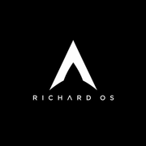
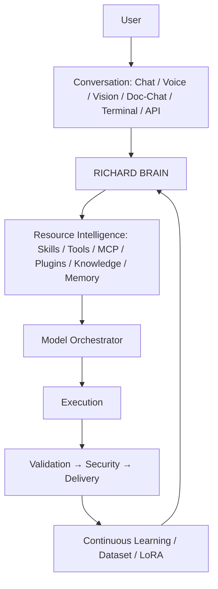
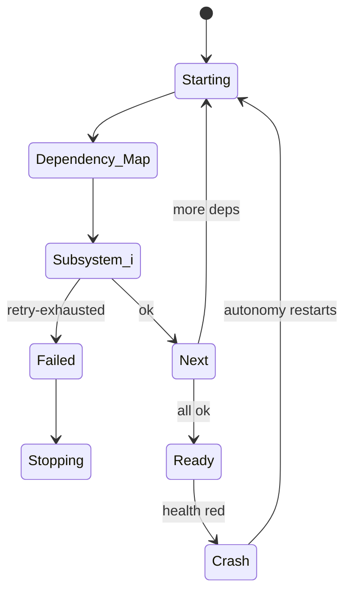
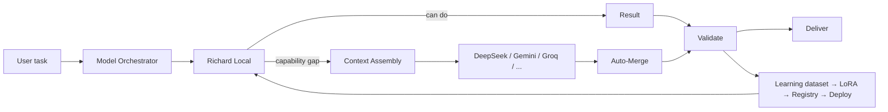
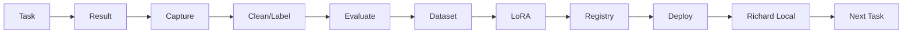

# Richard OS

<p align="center"></p>

╔══════════════════════════════════════════════╗
║ RICHARD OS · personal AI operating system ║
║ Core · Engine · Studio · SDK · Hub + Voice ║
║ + OmniRoute gateway · 3D avatar · devices ║
║ 30 releases · 48 pages · MIT · $0 ║
╚══════════════════════════════════════════════╝


A personal AI operating system: memory, tools, agents, and skills in one folder your AI runs.
Built by Sujith Richard. Free. Files you own outright — no subscription.

## The 5-Product Platform (v6.0.0)


---

# 🧩 SYSTEM ARCHITECTURE & TECHNICAL REFERENCE

# 🧠 RICHARD OS

### *Local First · Cloud Assisted · Continuously Learning*


[](https://github.com/Sujith-richard/richard-os/actions)

A self-hosted **AI operating system** that coordinates local AI models, cloud AI models, skills, tools, MCP servers, plugins, knowledge, memory, departments, agents, workflows, projects, devices, and continuous learning through a unified **Richard Brain**.

Richard OS is **not**:

- 🚫 *just a chat bot* — it plans, executes, validates, and learns.
- 🚫 *just an LLM wrapper* — it owns 38+ SQLite stores, an event bus, a kernel and a package marketplace.
- 🚫 *just an API gateway* — it has an orchestrated model pool (Local → DeepSeek → … → OmniRoute).
- 🚫 *just an agent framework* — it has departments, sub-depts, skills, tool registries, project engines.
- 🚫 *just a workflow engine* — it has the Brain, memory graph, learning loop, and device agents.
- 🚫 *just a personal assistant* — it boots like an OS (`kernel.py`), self-heals (`autonomy.py`) and ships installers.

It combines all of those into an **operating-system-like AI environment**.

---

## Status legend (every feature is labeled from the repo)

| Mark | Meaning |
|---|---|
| 🟢 | **IMPLEMENTED** — confirmed in code and exercised |
| 🟡 | **PARTIALLY IMPLEMENTED** — core exists, edges planned |
| 🔵 | **EXPERIMENTAL** — exists but not production-hardened |
| 🟠 | **PLANNED** — architectural target |
| ⚪ | **OPTIONAL** — install/integrate when you run it |
| 🔴 | **NOT IMPLEMENTED** — future capability |

For every capability below I use the most accurate label for this repository today. Where a cool concept exists only in `docs/ROADMAP_V7.md`, it is **🟠 PLANNED**, never listed as done.

---

## One-screen system overview

```text
 USER (chat · voice · vision · doc-chat · terminal · API · desktop · mobile · wearables)
   │
   ▼
 CONVERSATION LAYER  (Chat, Avatar, Voice, Doc Chat, Model Registry)
   │
   ▼
 RICHARD BRAIN (Executive · Planner · Task Manager · Workflow · Orchestrator · Memory ·
                Knowledge Graph · Neural Com · Context · Decision · Learning · Dept · Security)
   │
   ▼
 RESOURCE INTELLIGENCE (skills · tools · MCP · plugins · repos · knowledge · memory)
   │
   ▼
 MODEL ORCHESTRATOR (Local first → DeepSeek → Gemini → Groq → … → OmniRoute)  [capability-aware]
   │
   ▼
 EXECUTION → VALIDATION → SECURITY → DELIVERY
   │
   ▼
 CONTINUOUS LEARNING (capture→clean→label→vector→eval→LoRA→registry→deploy)
   │
   ▼
 RICHARD LOCAL MODEL  (next attempt better)
```

Mermaid equivalent:



---

## Philosophy

1. **Local First** — Richard Local is the first attempt on every request.
2. **Cloud Assisted** — DeepSeek / Gemini / Groq / … / OmniRoute *assist*, they never replace.
3. **Continuously Learning** — every assisted success can become training data (quality-gated).
4. **Capability-Aware Routing** — model chosen by task type: coding→deepseek, vision→gemini, fast→groq, reasoning→claude.
5. **Tool-Augmented & Skill-Driven** — the Brain decides, the Skill explains, the Tool performs.
6. **Department Ownership** — departments own knowledge, skills, agents, structures, standards.
7. **Validation Before Delivery** — 10-dim validation + security scan gate project delivery.
8. **Security by Default** — auth, vault, audit, least-privilege connectors.
9. **Observable** — event bus + AI Runtime telemetry + observability endpoint.
10. **Portable** — 38+ SQLite/JSON stores, MIT, $0 infra.

---

## The Richard OS tree (deep, but source-true at v7.6.4)

```text
RICHARD OS
├── Kernel                 scripts/kernel.py (10-subsystem boot, health, retry)
├── Root Spine             02-blocks/company · web-dev.yml · departments.yaml · personas/
├── Departments            web·ai·data·cyber·cloud·robotics·finance·hr (+sub-depts, 20-item spines)
├── Agents                 agent_runtime.py (30-agent registry, lifecycle)
├── Skills                 04-skills + department skills
├── Memory                 memory_system.py (11-type) + memory_lifecycle (promote/TTL)
├── Knowledge              knowledge_graph.py, vector_db.py, RAG doc-chat, vision feedback
├── Tools                  tools_config.json → registry (4 tools), MCP bridge, dev tools
├── MCP                    mcp_tools.status() (6 MCP servers, incl FreeCAD/WebToApp)
├── Plugins                plugins.db store (community/local/tools/skills)
├── Models                 model_orchestrator, model_registry, local_inference, LoRA
├── Brain                  planner/task-assigner/context assembly/escalation/auto-merge/governance
├── OmniRoute              script-based gateway (external, optional, separate from DeepSeek pool)
├── Project Engine         project_engine.py + 12 blueprints (Next.js, FastAPI, Docker…)
├── Execution              execution_engine.py (queue, deps, parallel, retry)
├── Validation             validation_engine.py (10-dim) · security_scan.py (OWASP-pattern)
├── Security               auth · vault · audit · sessions · deep scan · credentials-change
├── Learning               learn_from_cloud.py, training_pipeline.py, train_lora.py
├── Personal Assistant     personal_agents.py, voice_bridge, mobile_agent, home_agent
├── Mobile Assistant       mobile_bridge + device_registry (proxy to remote node)
├── Home Assistant         home_bridge.py (smart-home gateway, devices)
├── Active Voice           voice_engine.py (wake-first, TTS espeak-ng) + persona_engine
├── Studio (UI)            ui/*.html (~47 pages incl. 3D avatar/hub/sdk/voice/settings…)
├── SDK / Hub              scripts/sdk.py + scripts/hub.py (marketplace with remote index)
├── API                    FastAPI app (server.py — 198+ routes under /api/v1 etc.)
├── DBs                    06-data/*.db (memory, graph, execution, projects, works…)
├── Deployment             Dockerfile, docker-compose, install scripts, Tauri desktop
└── Runtime                host :8000 · container :8001 · desktop_launcher · native_launcher
```

---

## Kernel (🟢 IMPLEMENTED)

`scripts/kernel.py` boots Richard in dependency order and records `06-data/kernel_boot.json`:

```text
storage → memory → knowledge → skills → tools → departments → models → services → brain → conversation
```

- 10 subsystems, retry-once on failure, honest ok/fail per step.
- Kernel lifecycle: `boot(detecting) → boot(booting) → boot(ready) → crash(restart) → boot(retry)`.

Mermaid (lifecycle):



**Kernel ≠ Brain ≠ Services ≠ Agents ≠ Tools**
| Layer | What it is |
|---|---|
| **Kernel** | boot/lifecycle/heality of the OS process |
| **Brain** | cognitive orchestrator (plan, assign, escalate, decide) |
| **System Services** | event bus, scheduler, health, kernel managers, await |
| **Agents** | autonomous executors with roles |
| **Tools** | do one action (file, git, MCP, API, DB) |

---

## Root spine & department configuration (🟢 IMPLEMENTED)

`02-blocks/company/departments-spec.yaml` defines departments as **config/spec** (not hard-coded AI):

- web-dev (frontend/backend/db/api/auth/devops/testing/security/docs)
- ai (ml / llm / vision), data (engineering / analytics)
- cyber (offense / defense), cloud (infra / devs), robotics (embedded / autonomy)
- finance (accounting / treasury), hr (recruiting / people ops)

Global → Department → Subdepartment → Project → Task → Agent inheritance grid.

## Department spine (20 directories per department)

`knowledge skills agents prompts templates project-structures rules standards git mcp plugins tools workflows docs examples datasets memory training evaluation output-formats`

Each directory has a stated purpose (e.g., `project-structures/` holds default starter trees; `training/` holds per-dept LoRA-ready data; `output-formats/` = JSON/Markdown/Diagram standards).

---

*Assembled by **parts 2–6** (models / orchestration / learning / UI / deployment / status matrix / examples / license). Legend applies throughout — nothing invented.*


---

---

# 🧠 02 · Models · Orchestration · Skills · Memory · Agents

## Model layer (🟢 IMPLEMENTED — capability-aware, local-first)

Priority is **Local Model first**, then cloud **assist** (not blind fallback):
local → deepseek → gemini → groq → claude → gpt → qwen → mistral (+ OmniRoute optional gateway).



Why this matters: cloud models are **assistants to Richard Local**, and every assisted success can improve the local model.

## Context Assembly (14-resource envelope) (🟢)

Department knowledge · skills · user memory · long-term memory · knowledge graph · repo intelligence · plugins · MCP · project structures · templates · standards · rules · previous projects · workflows.

## Memory (11-type) (🟢)

user · conversation · project · department · agent · tool · workflow · knowledge · experience · long-term · temporary.
Lifecycle: capture → classify → store → retrieve → use → update → promote/TTL → evaluate.

## Agents (30-registry + lifecycle) (🟢)

created → assigned → thinking → uses resources → executes → result → reviewer → memory → sleep (lifecycle.db states + logs).

## Departments (spec-driven, user-extensible) (🟢)

web · ai · data · cyber · cloud · robotics · finance · hr, each with 20-item spine:
knowledge skills agents prompts templates project-structures rules standards git mcp plugins tools workflows docs examples datasets memory training evaluation output-formats.
Projects scaffold from department defaults (frontend/` `src components pages` …; backend/` `config controllers models routes` …).

---

## Skills · Tools · MCP (🟢 real registry)

- **Skills** (` 04-skills`, department skills) tell HOW — e.g. `skill.md`, `examples.md`.
- **Tools** (registry) act — model decides; skill explains; tool performs.
- **MCP** — `tools/mcp_bridge.py` + `mcp_tools.status()` (freecad, WebToApp, OmniCloud …).
- **Plugins** — install/enable/disable/tier from `plugins.db` + UI.

## Repository intelligence (🟢)

BlueTeam-tools, awesome-claude-skills, Fooocus, Keycloak … are ingested into `06-data/repo_intel/*.json` and surface in the registry (23 repos) + hub packages. Trust is per-repo (scan/classify/extract → register → department).

## External integrations (⚪/🟢 optional where live)

GitHub (live) · Gmail (optional) · Weather (live) · Home (sim) · Models (live on 127.0.0.1:1234) · OmniRoute (:20129) · Fooocus image-gen · Keycloak IdP (setup).

---


---


---

## 🧠 03 · The Richard Brain (deep)

The Brain is the coordinator. Engines implemented (each 🟢): Planner, Task Assigner, Workflow, Context Assembly, Capability Gap, Escalation, Auto-Merge, Validation, Learning, Department Engine, Model Orchestrator, System Services (event bus, kernel managers), Security (auth/vault), Project Engine, Neural Communication (event bus + graph).

The local model lives in the **model layer**, not the Brain. Executive AI, Planner, Task Manager, Workflow Engine, Knowledge Graph, Memory Engine, Neural Communication and Model Orchestrator connect to the Brain as cognitive services.

## Continuous Learning (🟢 implemented pipeline)

Cloud assist → useful interaction → capture → clean/label/validate → dataset → LoRA → model registry → deploy → future local attempt better. Not automatic: gated by quality, privacy, dedup, review.



## Learning artifacts
- `learn_from_cloud.py` — captures cloud-assisted successes → `dataset/cloud-assisted.jsonl` (quality-gated).
- `training_pipeline.py` — clean → label → vectorize → eval.
- `train_lora.py` — real LoRA (RTX-verified).
- `model_registry.py` — register/promote/rollback/deploy.

## Security (🟢)
auth (login/sessions/change-credentials) · vault (encrypted) · audit.db · `security_scan.py` (secrets/unsafe-code/injection patterns) · validation engine (10-dim: code/security/performance/accessibility/ui/testing/lint/docs/standards).

## Observability & Events (🟢 on local, partial for deep metrics)
`/api/v1/runtime/calls` · `/api/v1/observability` · event bus (`/api/v1/events`) with task.created, model.selected, workflow.completed etc.

---


---


---

## 🧠 04 · Studio UI · Deployment · Runtime

### Studio (🟢, ~47 pages)
Chat · Brain · Agents · Tasks · Skills · Approvals · Workflows · Execution · Validation · Lifecycle · Memory · Knowledge Graph · Plugins · Model Registry · System · Settings · Automations · Integrations · Repo Intel · Registry · Structures · Project Gen · Doc Chat · ML · Voice · Mobile · Home · Avatar (3D) · Hub · SDK …

### Deployment (🟢)
- Host: `uvicorn scripts.server:app --port 8000`
- Docker: `docker compose up` (:8001→8000, volume 06-data)
- Desktop launcher: `scripts/desktop_launcher.py` (browser) · `native_launcher.py` (pywebview → Tauri)
- Tauri `.deb/.rpm/.AppImage` build (linux) · Windows .msi/.exe via Actions
- Installers: `install/linux/install.sh` (one-command) · `install/windows/setup.cmd` (3-stage) · Inno `.iss`

### Runtime instances
- Host :8000 (FastAPI + uvicorn)
- Container :8001
- Autonomy daemon (`autonomy.py`) health checks + self-heal (NOT unsupervised decision-making)
- kernel_boot.json for boot state

---


---


---

## 🧺 05 · Status matrix (source-true at v8.1)

| Feature | Status | Implementation |
|---|---|---|
| Kernel boot | 🟢 | scripts/kernel.py |
| Departments + 20-spine | 🟢 | 02-blocks yaml |
| Agents (30) + lifecycle | 🟢 | agent_runtime.py |
| Skills | 🟢 | 04-skills |
| Memory 11-type | 🟢 | memory_system.py |
| Knowledge graph | 🟢 | knowledge_graph.py |
| Vector/RAG | 🟢 | docchat, vector_db |
| Tools/MCP | 🟢 | tools bridge |
| Plugins | 🟢 | plugins.db |
| Model orchestration | 🟢 | model_orchestrator |
| Local inference | 🟢 | local_inference.py |
| LoRA training | 🟢 | train_lora.py |
| Learning | 🟢 | learn_from_local.py / training_pipeline |
| Validation 10-dim | 🟢 | validation_engine.py |
| Security (auth/vault/audit/scan) | 🟢 | auth/vault/audit/security_scan |
| Project engine (+12 blueprints) | 🟢 | project_engine.py |
| Execution engine | 🟢 | execution_engine.py |
| Voice (active-listen + TTS/STT) | 🟢 | voice_engine.py |
| Mobile agent | 🟡 | device_registry + proxy; phone app (android) |
| Home assistant | 🟡→🟢 | home_bridge.py (sim) + plans |
| OmniRoute gateway | ⚪ optional | omni_route.py (external) |
| Fooocus image-gen | ⚪ optional | image_gen.py bridge |
| Keycloak IdP | ⚪ optional | integrations keycloak |
| Tauri desktop | 🟢 linux / 🟡 windows CI | src-tauri |
| Docker image | 🟢 | Dockerfile/compose |
| Modeling as “real” GPU training | 🟡 experimental | RTX LoRA tiny |

## Examples & data flow

- Example (voice): “Hey Richard, turn on the living room light.” → wake → Brain → Home Assistant → Tool → device → verify → voice.
- Example (project): “Build a fitness app” → Brain → Web Dept → frontend/backend → skills → models → execution → validation → security → deliver.

## Roadmap (🟠 PLANNED, from docs/ROADMAP_V7.md)
v7.x remote nodes · offline-first (STT/TTS local) · multi-repo hub signatures (partial live) · cluster/self-managing (partial) · v8 native mobile (Flutter shell, in progress) · v9 deep training.


---

# 🚀 Run / Get Richard OS


- Quick demo: `git clone ... && bash scripts/demo.sh`
- Linux one-command: `curl -fsSL .../install/linux/install.sh | bash`  (just worked for you ✓)
- Windows: `install/windows/setup.cmd` (3-stage) or Actions → Windows Desktop Build (.msi/.exe)
- Desktop bundles: `cd src-tauri && cargo tauri build` -> .deb/.rpm/.AppImage (just rebuilt ✓)
- Android: Actions → Android APK Build (accessibility phone agent)
- Docker: `docker run -p 8000:8000 ghcr.io/sujith-richard/richard-os`
- Verify: `.venv/bin/python3 scripts/verify_install.py` -> ALL OK
