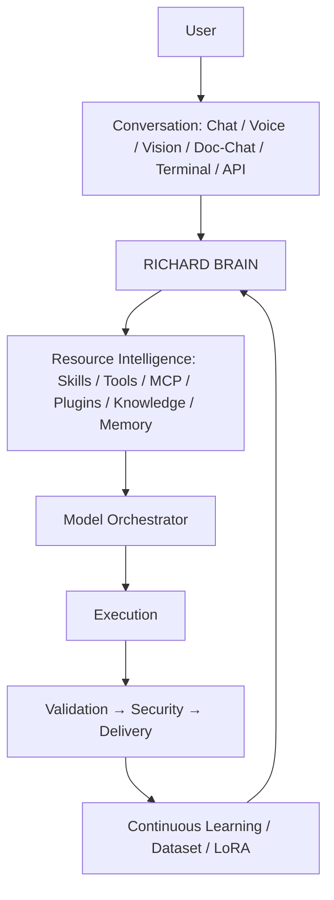
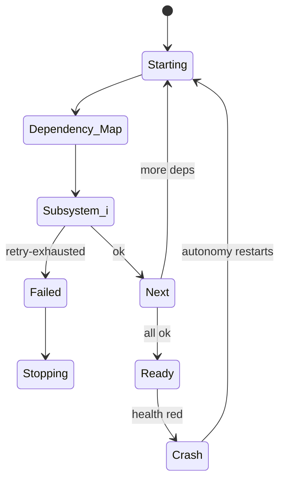

# 🧠 RICHARD OS

### *Local First · Cloud Assisted · Continuously Learning*


[](https://github.com/Sujith-richard/richard-os/actions)

A self-hosted **AI operating system** that coordinates local AI models, cloud AI models, skills, tools, MCP servers, plugins, knowledge, memory, departments, agents, workflows, projects, devices, and continuous learning through a unified **Richard Brain**.

Richard OS is **not**:

- 🚫 *just a chat bot* — it plans, executes, validates, and learns.
- 🚫 *just an LLM wrapper* — it owns 38+ SQLite stores, an event bus, a kernel and a package marketplace.
- 🚫 *just an API gateway* — it has an orchestrated model pool (Local → DeepSeek → … → OmniRoute).
- 🚫 *just an agent framework* — it has departments, sub-depts, skills, tool registries, project engines.
- 🚫 *just a workflow engine* — it has the Brain, memory graph, learning loop, and device agents.
- 🚫 *just a personal assistant* — it boots like an OS (`kernel.py`), self-heals (`autonomy.py`) and ships installers.

It combines all of those into an **operating-system-like AI environment**.

---

## Status legend (every feature is labeled from the repo)

| Mark | Meaning |
|---|---|
| 🟢 | **IMPLEMENTED** — confirmed in code and exercised |
| 🟡 | **PARTIALLY IMPLEMENTED** — core exists, edges planned |
| 🔵 | **EXPERIMENTAL** — exists but not production-hardened |
| 🟠 | **PLANNED** — architectural target |
| ⚪ | **OPTIONAL** — install/integrate when you run it |
| 🔴 | **NOT IMPLEMENTED** — future capability |

For every capability below I use the most accurate label for this repository today. Where a cool concept exists only in `docs/ROADMAP_V7.md`, it is **🟠 PLANNED**, never listed as done.

---

## One-screen system overview

```text
 USER (chat · voice · vision · doc-chat · terminal · API · desktop · mobile · wearables)
   │
   ▼
 CONVERSATION LAYER  (Chat, Avatar, Voice, Doc Chat, Model Registry)
   │
   ▼
 RICHARD BRAIN (Executive · Planner · Task Manager · Workflow · Orchestrator · Memory ·
                Knowledge Graph · Neural Com · Context · Decision · Learning · Dept · Security)
   │
   ▼
 RESOURCE INTELLIGENCE (skills · tools · MCP · plugins · repos · knowledge · memory)
   │
   ▼
 MODEL ORCHESTRATOR (Local first → DeepSeek → Gemini → Groq → … → OmniRoute)  [capability-aware]
   │
   ▼
 EXECUTION → VALIDATION → SECURITY → DELIVERY
   │
   ▼
 CONTINUOUS LEARNING (capture→clean→label→vector→eval→LoRA→registry→deploy)
   │
   ▼
 RICHARD LOCAL MODEL  (next attempt better)
```

Mermaid equivalent:



---

## Philosophy

1. **Local First** — Richard Local is the first attempt on every request.
2. **Cloud Assisted** — DeepSeek / Gemini / Groq / … / OmniRoute *assist*, they never replace.
3. **Continuously Learning** — every assisted success can become training data (quality-gated).
4. **Capability-Aware Routing** — model chosen by task type: coding→deepseek, vision→gemini, fast→groq, reasoning→claude.
5. **Tool-Augmented & Skill-Driven** — the Brain decides, the Skill explains, the Tool performs.
6. **Department Ownership** — departments own knowledge, skills, agents, structures, standards.
7. **Validation Before Delivery** — 10-dim validation + security scan gate project delivery.
8. **Security by Default** — auth, vault, audit, least-privilege connectors.
9. **Observable** — event bus + AI Runtime telemetry + observability endpoint.
10. **Portable** — 38+ SQLite/JSON stores, MIT, $0 infra.

---

## The Richard OS tree (deep, but source-true at v7.6.4)

```text
RICHARD OS
├── Kernel                 scripts/kernel.py (10-subsystem boot, health, retry)
├── Root Spine             02-blocks/company · web-dev.yml · departments.yaml · personas/
├── Departments            web·ai·data·cyber·cloud·robotics·finance·hr (+sub-depts, 20-item spines)
├── Agents                 agent_runtime.py (30-agent registry, lifecycle)
├── Skills                 04-skills + department skills
├── Memory                 memory_system.py (11-type) + memory_lifecycle (promote/TTL)
├── Knowledge              knowledge_graph.py, vector_db.py, RAG doc-chat, vision feedback
├── Tools                  tools_config.json → registry (4 tools), MCP bridge, dev tools
├── MCP                    mcp_tools.status() (6 MCP servers, incl FreeCAD/WebToApp)
├── Plugins                plugins.db store (community/local/tools/skills)
├── Models                 model_orchestrator, model_registry, local_inference, LoRA
├── Brain                  planner/task-assigner/context assembly/escalation/auto-merge/governance
├── OmniRoute              script-based gateway (external, optional, separate from DeepSeek pool)
├── Project Engine         project_engine.py + 12 blueprints (Next.js, FastAPI, Docker…)
├── Execution              execution_engine.py (queue, deps, parallel, retry)
├── Validation             validation_engine.py (10-dim) · security_scan.py (OWASP-pattern)
├── Security               auth · vault · audit · sessions · deep scan · credentials-change
├── Learning               learn_from_cloud.py, training_pipeline.py, train_lora.py
├── Personal Assistant     personal_agents.py, voice_bridge, mobile_agent, home_agent
├── Mobile Assistant       mobile_bridge + device_registry (proxy to remote node)
├── Home Assistant         home_bridge.py (smart-home gateway, devices)
├── Active Voice           voice_engine.py (wake-first, TTS espeak-ng) + persona_engine
├── Studio (UI)            ui/*.html (~47 pages incl. 3D avatar/hub/sdk/voice/settings…)
├── SDK / Hub              scripts/sdk.py + scripts/hub.py (marketplace with remote index)
├── API                    FastAPI app (server.py — 198+ routes under /api/v1 etc.)
├── DBs                    06-data/*.db (memory, graph, execution, projects, works…)
├── Deployment             Dockerfile, docker-compose, install scripts, Tauri desktop
└── Runtime                host :8000 · container :8001 · desktop_launcher · native_launcher
```

---

## Kernel (🟢 IMPLEMENTED)

`scripts/kernel.py` boots Richard in dependency order and records `06-data/kernel_boot.json`:

```text
storage → memory → knowledge → skills → tools → departments → models → services → brain → conversation
```

- 10 subsystems, retry-once on failure, honest ok/fail per step.
- Kernel lifecycle: `boot(detecting) → boot(booting) → boot(ready) → crash(restart) → boot(retry)`.

Mermaid (lifecycle):



**Kernel ≠ Brain ≠ Services ≠ Agents ≠ Tools**
| Layer | What it is |
|---|---|
| **Kernel** | boot/lifecycle/heality of the OS process |
| **Brain** | cognitive orchestrator (plan, assign, escalate, decide) |
| **System Services** | event bus, scheduler, health, kernel managers, await |
| **Agents** | autonomous executors with roles |
| **Tools** | do one action (file, git, MCP, API, DB) |

---

## Root spine & department configuration (🟢 IMPLEMENTED)

`02-blocks/company/departments-spec.yaml` defines departments as **config/spec** (not hard-coded AI):

- web-dev (frontend/backend/db/api/auth/devops/testing/security/docs)
- ai (ml / llm / vision), data (engineering / analytics)
- cyber (offense / defense), cloud (infra / devs), robotics (embedded / autonomy)
- finance (accounting / treasury), hr (recruiting / people ops)

Global → Department → Subdepartment → Project → Task → Agent inheritance grid.

## Department spine (20 directories per department)

`knowledge skills agents prompts templates project-structures rules standards git mcp plugins tools workflows docs examples datasets memory training evaluation output-formats`

Each directory has a stated purpose (e.g., `project-structures/` holds default starter trees; `training/` holds per-dept LoRA-ready data; `output-formats/` = JSON/Markdown/Diagram standards).

---

*Assembled by **parts 2–6** (models / orchestration / learning / UI / deployment / status matrix / examples / license). Legend applies throughout — nothing invented.*
