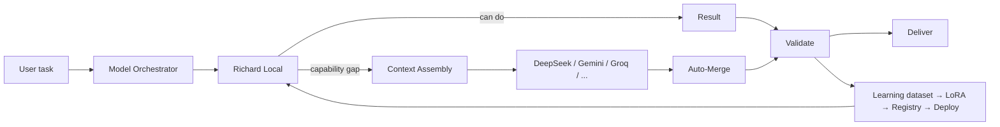

---

# 🧠 02 · Models · Orchestration · Skills · Memory · Agents

## Model layer (🟢 IMPLEMENTED — capability-aware, local-first)

Priority is **Local Model first**, then cloud **assist** (not blind fallback):
local → deepseek → gemini → groq → claude → gpt → qwen → mistral (+ OmniRoute optional gateway).

Why this matters: cloud models are **assistants to Richard Local**, and every assisted success can improve the local model.

## Context Assembly (14-resource envelope) (🟢)

Department knowledge · skills · user memory · long-term memory · knowledge graph · repo intelligence · plugins · MCP · project structures · templates · standards · rules · previous projects · workflows.

## Memory (11-type) (🟢)

user · conversation · project · department · agent · tool · workflow · knowledge · experience · long-term · temporary.
Lifecycle: capture → classify → store → retrieve → use → update → promote/TTL → evaluate.

## Agents (30-registry + lifecycle) (🟢)

created → assigned → thinking → uses resources → executes → result → reviewer → memory → sleep (lifecycle.db states + logs).

## Departments (spec-driven, user-extensible) (🟢)

web · ai · data · cyber · cloud · robotics · finance · hr, each with 20-item spine:
knowledge skills agents prompts templates project-structures rules standards git mcp plugins tools workflows docs examples datasets memory training evaluation output-formats.
Projects scaffold from department defaults (frontend/` `src components pages` …; backend/` `config controllers models routes` …).

---

## Skills · Tools · MCP (🟢 real registry)

- **Skills** (` 04-skills`, department skills) tell HOW — e.g. `skill.md`, `examples.md`.
- **Tools** (registry) act — model decides; skill explains; tool performs.
- **MCP** — `tools/mcp_bridge.py` + `mcp_tools.status()` (freecad, WebToApp, OmniCloud …).
- **Plugins** — install/enable/disable/tier from `plugins.db` + UI.

## Repository intelligence (🟢)

BlueTeam-tools, awesome-claude-skills, Fooocus, Keycloak … are ingested into `06-data/repo_intel/*.json` and surface in the registry (23 repos) + hub packages. Trust is per-repo (scan/classify/extract → register → department).

## External integrations (⚪/🟢 optional where live)

GitHub (live) · Gmail (optional) · Weather (live) · Home (sim) · Models (live on 127.0.0.1:1234) · OmniRoute (:20129) · Fooocus image-gen · Keycloak IdP (setup).

---
