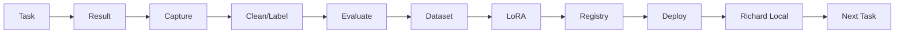

---

## 🧠 03 · The Richard Brain (deep)

The Brain is the coordinator. Engines implemented (each 🟢): Planner, Task Assigner, Workflow, Context Assembly, Capability Gap, Escalation, Auto-Merge, Validation, Learning, Department Engine, Model Orchestrator, System Services (event bus, kernel managers), Security (auth/vault), Project Engine, Neural Communication (event bus + graph).

The local model lives in the **model layer**, not the Brain. Executive AI, Planner, Task Manager, Workflow Engine, Knowledge Graph, Memory Engine, Neural Communication and Model Orchestrator connect to the Brain as cognitive services.

## Continuous Learning (🟢 implemented pipeline)

Cloud assist → useful interaction → capture → clean/label/validate → dataset → LoRA → model registry → deploy → future local attempt better. Not automatic: gated by quality, privacy, dedup, review.

## Learning artifacts
- `learn_from_cloud.py` — captures cloud-assisted successes → `dataset/cloud-assisted.jsonl` (quality-gated).
- `training_pipeline.py` — clean → label → vectorize → eval.
- `train_lora.py` — real LoRA (RTX-verified).
- `model_registry.py` — register/promote/rollback/deploy.

## Security (🟢)
auth (login/sessions/change-credentials) · vault (encrypted) · audit.db · `security_scan.py` (secrets/unsafe-code/injection patterns) · validation engine (10-dim: code/security/performance/accessibility/ui/testing/lint/docs/standards).

## Observability & Events (🟢 on local, partial for deep metrics)
`/api/v1/runtime/calls` · `/api/v1/observability` · event bus (`/api/v1/events`) with task.created, model.selected, workflow.completed etc.

---
