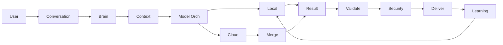

# 🧠 RICHARD OS

## Official User Guide

### Install · Configure · Connect · Create · Automate · Learn

Status legend: 🟢 **Available** · 🟡 **Partial** · 🔵 **Experimental** · 🟠 **Planned** · ⚪ **Optional** · 🔴 **Unavailable**

---

# PART I — GETTING STARTED

## 1. What Is Richard OS?

Richard OS is a self-hosted **AI operating environment**. It is not just a chatbot or a model wrapper: it coordinates the layers a task needs, and learns so the next task is better.

You interact with it through **conversation** (chat, voice, vision, document chat, terminal, API, desktop). Behind the conversation, Richard OS organizes five capability layers:

| Layer | Answers |
|---|---|
| **Models** | Who thinks? |
| **Skills** | How should the task be performed? |
| **Tools** | What can take action? |
| **Knowledge** | What information is available? |
| **Departments** | Who owns the work? |

Example user request:

> *"Build a full-stack fitness application."*

Richard OS: sends it to the **Brain** → context assembly → web department → frontend/backend subdepartments → skills → tools → model → execution → validation → result.

## 2. Richard OS at a Glance

```text
                    USER
                      │
                      ▼
              CONVERSATION (chat·voice·vision·doc-chat·API)
                      │
                      ▼
                RICHARD BRAIN
                      │
        ┌─────────────┼─────────────┐
        ▼             ▼             ▼
     MODELS        SKILLS        KNOWLEDGE
        │             │             │
        └─────────────┼─────────────┘
                      ▼
                    TOOLS · MCP · PLUGINS
                      │
                      ▼
                  DEPARTMENTS
                      │
                      ▼
              PROJECT / WORKFLOW
                      │
                      ▼
                   RESULT
                      │
                      ▼
                LEARNING → LOCAL MODEL
```

## 3. System Requirements

| | Minimum | Recommended | Local AI / LoRA (optional) |
|---|---|---|---|
| OS | Linux · Windows 10/11 | Ubuntu 24.04 | Linux |
| CPU | 2-core | 4+ core | 6+ core |
| RAM | 4 GB | 8 GB | 16 GB |
| GPU | — | — | NVIDIA RTX 3050 4GB+ (CUDA) |
| Disk | 2 GB free | 5 GB | + 5–10 GB weights |
| Python | 3.10 | 3.12 | 3.12 |
| Docker | — | 24.x | — |
| Browser | Chrome/Edge/Firefox | same | same |

Optional components: Node 22 (only if you run the OmniRoute gateway), CUDA-capable NVIDIA GPU, `espeak-ng` (offline TTS, `sudo apt install espeak-ng`).

## 4. Windows Installation

🟢 Today: **Python + uvicorn** (run the server → open browser) and a **3-stage wizard** (`install/windows/setup.cmd`):

```text
Download/clone
 → prerequisites (Python + Git for Windows)
 → install/start (run setup.cmd, or clone + pip)
 → configure .env
 → configure models
 → start (uvicorn or desktop_launcher)
 → open UI (http://127.0.0.1:8000/ui/)
 → login
```

- Inno Setup users: open `install/windows/RichardOS_Setup.iss` in Inno Setup → Compile → `Richard_OS_Setup.exe`.
- CI-built `.msi/.exe`: GitHub Actions → **Windows Desktop Build** → download artifacts (⚪).
- 🟠 Native packaged install (updater / service manager / tray) is planned, not present.

## 5. Linux Installation

🟢 Complete path (verified end-to-end):

```bash
# prerequisites
sudo apt update && sudo apt install -y git python3 python3-venv

# clone
git clone https://github.com/Sujith-richard/richard-os.git
cd richard-os

# environment + deps
python3 -m venv .venv
.venv/bin/pip install -r requirements.txt

# config
cp .env.example .env        # DATA_MODE=fake by default
.venv/bin/python3 scripts/auth.py --setup sujith "Richard-YourOwn"

# start
nohup .venv/bin/python3 -m uvicorn scripts.server:app --host 127.0.0.1 --port 8000 &

# open UI
.venv/bin/python3 scripts/desktop_launcher.py

# verify
curl -s http://127.0.0.1:8000/agent-status
```

One-command installer (🟢):

```bash
curl -fsSL https://raw.githubusercontent.com/Sujith-richard/richard-os/main/install/linux/install.sh | bash
```

After install: `cd ~/richard-os && .venv/bin/python3 scripts/desktop_launcher.py`

## 6. Docker Installation

🟢 Containerized instance (verified on :8001 → host :8000):

```bash
docker build -t richard-os:latest .         # or use docker-compose
docker compose up -d                        # maps 8001:8000, volume 06-data, restart policy
docker logs -f richard-os
# UI at http://127.0.0.1:8001/ui/
```

Notes: the image installs deps at build; `06-data/` persists (volume); the `.dockerignore` keeps build context ~200 MB; GPU passthrough is 🟠 planned (use `--gpus all` with a custom compose when needed).

## 7. First Launch (kernel boot)

On start, `scripts/kernel.py` boots 10 subsystems in order:

```text
storage → memory → knowledge → skills → tools → departments
       → models → services → brain → conversation
```

Each step is logged to `06-data/kernel_boot.json` with retry-once on failure. You then see: **login** → **splash (black + logo)** → **Richard OS Studio** (sidebar + topbar).

---

# PART II — FIRST CONFIGURATION

## 8. First-Time Setup

| What | Where | Details |
|---|---|---|
| Create user | `scripts/auth.py --setup` (or POST /api/v1/auth/users) | pbkdf2-hashed, stored in `06-data/users.json` |
| Login | `/ui/login.html` | token in `richard_token` cookie |
| Fake vs real data | Settings → **Integration Mode** (toggle) | off = real connectors |
| Models | Chat/Models pages or `model_orchestrator` route table | local-first, then providers |
| Providers | `/api/v1/models/providers`, `-direct` gateway | DeepSeek on 127.0.0.1:1234 (Pool 2), OmniRoute on :20128 (Pool 3, optional) |
| Skills/Departments | `04-skills`, `02-blocks/*` | user-extensible |

## 9. Environment Variables

Only those actually used (example values — never real keys):

| Variable | Purpose | Required | Example |
|---|---|---|---|
| `DATA_MODE` | fake / real integration mode | yes | `fake` |
| `GMAIL_*` | gmail connector | no | `<you>@gmail.com`, `<app-password>` |
| `GITHUB_*` | repo intelligence | no | owner `Sujith-richard` |
| `OMNIROUTE_URL` / `OMNIROUTE_KEY` | optional gateway | no | `http://127.0.0.1:20128/v1` |
| `RICHARD_MASTER_KEY` | vault key | no | (base64) |
| `MODEL_DIR` | local model path | no | `06-data/models/` |

**Security:** never commit `.env`, `users.json`, `sessions.json`, `vault.json`, or API keys.

## 10. Security & Credentials

- 🟢 Login/logout/sessions (auth.py)
- 🟢 Vault (encrypted secrets, `vault.py` + `/api/v1/vault`)
- 🟢 Audit (audit.db), security scan (`security_scan.py`)
- 🟢 Change username/password (Settings → Credentials, requires current)

**Do not** commit secrets; use the vault; grant least privilege to connectors & MCP servers.


---

# PART III — USING RICHARD OS

## 11. Dashboard & Studio

Open `http://127.0.0.1:8000/ui/` (or `desktop_launcher.py`) and log in. You land on the **Richard OS Studio**: a sidebar of ~47 pages + a topbar (QUICK ADD, NOTIFY, THEME, scheduler LED, LISTENING/voice pill, CMD-K palette).

Key pages (all 🟢 exist):
Dashboard, Chat, Brain, Agents, Tasks, Skills, Approvals, Workflows, Execution, Validation, Lifecycle, Memory, Knowledge Graph, Plugins, Model Registry, Models, System, Settings, Automations, Collaboration, Organization, Departments, Personas, Life, Comms, Funnel, Finance, Social, Content, Integrations, Analytics, Roadmap, Repo Intel, Registry, Project Gen, Structures, Doc Chat, ML Box, Voice, Mobile, Home, Avatar, Hub, SDK …

Each is a real page; Dashboard shows the quick state, Chat is the primary conversation.

## 12. Chat

On Chat, type naturally:

> Build a full-stack fitness application.

The flow (server + brain):

```text
Chat → Brain → Context Assembly → Department (web) → Subdepartments
      → Skills → Knowledge → Model Orchestrator → Tool/Execution → Result
```

You don't need to pre-pick a department; the Brain routes.

## 13. Giving good instructions

Bad: `build app`  
Better: `Build a full-stack fitness application with user authentication, workout tracking, a dashboard, a REST API, and a SQLite database.`

Include: goal · requirements · technology · constraints · reference output · acceptance criteria.

## 14. Chat modes

| Mode | How | What it's for |
|---|---|---|
| Chat | text | general tasks |
| Voice | wake word + STT | hands-free commands |
| Vision | image path/prompt | image understanding (RAG + vision models) |
| Doc Chat | upload PDF/docs → RAG | ask your documents |
| Terminal | `desktop_launcher.py`/server | API & OS-level use |
| API | `/api/v1/*` | integrate other apps |

---

# PART IV — THE BRAIN

## 15. What the Brain is

The Brain is the coordinator. Engines in the repo (each 🟢): Planner, Task Assigner, Workflow, Context Assembly, Capability Gap, Escalation, Auto-Merge, Validation, Learning, Department Engine, Model Orchestrator, Security (auth/vault), Project Manager-oriented Project Engine, Knowledge Graph + Neural Communication (event bus + graph).

The local model lives in the **Model layer**, not the Brain; the Brain decides.

## 16. Context Assembly (14-source envelope)

Before a model replies, it gets a **context envelope**: department knowledge, skills, user memory, long-term memory, knowledge graph, repo intelligence, plugins, MCP, project structures, templates, standards, rules, previous projects, workflows.

```text
USER REQUEST
  ↓
CONTEXT ASSEMBLY (14 sources)
  ↓
UNIFIED CONTEXT ENVELOPE
  ↓
MODEL ORCHESTRATOR → MODEL
```

This prevents the model from "rediscovering" what the OS already knows.

---

# PART V — MODELS

## 17. Local vs cloud

- **Local**: Richard Local (LoRA-tuned/open weights), available offline (🟢 experimental quality from fine-tune, real GPU inference).
- **Cloud**: providers; each is an assistant, not a replacement.

## 18. Model Orchestrator (capability-aware)

```text
Task → Orchestrator → Local → can it? YES → go
             NO → capability gap → context → cloud (deepseek → gemini → groq → …) → merge → validate
```

Routable per domain: coding→deepseek · vision→gemini · speed→groq · reasoning→higher model · OmniRoute fallback (Pool 3).

## 19. Add/register a model

- Direct provider: write provider in `model_orchestrator` route table (or via `POST /api/v1/models/providers` if supported) with fields: provider · id · endpoint · key · context · vision · coding · reasoning · availability · priority.
- Registry page: promote/deploy/rollback local models (`model_registry.py` + `ui/models-registry.html`).
- OmniRoute (Pool 3, optional): point `omni_route.json` at the gateway; discovery returns live catalog.

## 20. Local model (running/training)

- Inference: `scripts/local_inference.py` (real CUDA; verify with `GET /api/v1/models/local/status`).
- Fine-tune: `training_pipeline.py` → `train_lora.py` → `model_registry` deploy → local model improves.
- **Important:** this improves the specialized behaviors in the training data; it does not magically match a frontier LLM.

## 21. OmniRoute (separate)

OmniRoute is an **optional external gateway** (Pool 3) — separate from your direct DeepSeek pool (Pool 2), which stays untouched. It aggregates many providers/free tiers for capability-awges routing when you need a wider pool.

---

# PART VI — SKILLS · KNOWLEDGE · TOOLS · MCP · PLUGINS

## 22. Skills

A skill = instructions for HOW to do something (≠ tool, ≠ model). Sources: internal `04-skills`, department skills `02-blocks/*/skills`, user skills (editable folders), external repos (Claude-style `awesome-claude-skills` real).

Install/enable: see `scripts/sdk.py new|validate|pack|publish` + `plugin_store.py` catalog; skills are markdown (e.g. `skill.md`, `examples.md`).

## 23. Knowledge

Teach Richard: PDF upload (Doc Chat + RAG → knowledge graph), GitHub repos (`repo_intel.py` → registry), notes, docs, prompts. Store: vector index (`vector_index.json`), memory db, knowledge graph db.

## 24. Tools & MCP

- Model decides · Skill explains · Tool acts (repo, git, docker, MCP, APIs, devices).
- MCP: bridge in `tools/mcp_bridge.py` + `mcp_tools.status()` (6 MCP servers: freecad-mcp, WebToApp, OmniCloud, map-to-poster, website-downloader …). Add your own MCP server → registry.

## 25. Plugins

Install/uninstall/tier from `plugins.db` + UI Plugin page; external repos appear as Community plugins after repo intel. Permissions = least privilege (review before enable).


---

# PART VII — DEPARTMENTS & PROJECTS

## 26. Departments

Departments are **ownership boundaries** (each with knowledge, skills, agents, prompts, templates, project-structures, rules, standards, git, mcp, plugins, tools, workflows, docs, examples, datasets, memory, training, evaluation, output-formats). Current: **web · ai · data · cyber · cloud · robotics · finance · hr** (+ subdepts: web→frontend/backend/db/api/auth/devops/testing/security/docs; ai→ml/llm/vision; data→engineering/analytics; cyber→offense/defense; cloud→infra/devops; robotics→embedded/autonomy; finance→accounting/treasury; hr→recruiting/people-ops). All spec-driven in `02-blocks/*.yaml`.

## 27. Project generation

```text
Requirement → department → subdepartments → structure → skills → knowledge
→ agents → models → files → test → security → validation → docs → package → deliver → learn
```

Use the **Project Generator** page (or `project_engine.py` API): pick blueprint (React/Next/Vue/FastAPI/Django/Express/… ) and it scaffolds the tree (e.g. frontend/ `public src components pages hooks context services utils routes store App.jsx main.jsx`; backend/ `config controllers models routes middleware services utils app.js server.js`).

Projects are **iterative**: plan → generate → test → observe gap → assign agent → fix → test → security → validate → repeat until pass.

## 28. Tasks & Workflows

- **Tasks**: `task_assigner.py` — assign me a task by keyword/role; status, retry, completion.
- **Workflows**: `workflow_engine.py` + `workflows.db` — trigger → tasks → agents → tools → validation → next.
- **Execution**: `execution_engine.py` — queue, dependencies, parallel groups, retries, progress %, done/error.

## 29. Memory

11-type system (`memory_system.py`): user / conversation / project / department / agent / tool / workflow / knowledge / experience / long-term / temporary. Lifecycle: memory_lifecycle promote temp→long-term by importance/age, TTL cleanup; view/search/manage on Memory page.

## 30. Knowledge Graph

`knowledge_graph.py` + UI (`kg.html`): nodes (user, department, agent, model, skill, tool, repos, project, task, workflow, memory, doc, dataset, device) and relations (USES, KNOWS, DEPENDS_ON, BELONGS_TO, EXECUTES, CREATED_BY, LEARNS_FROM, VALIDATES, ASSISTS, CONNECTED_TO). The **Brain graph** (avatar, 3D) renders these connections live.

---

# PART VIII — PERSONAL & EDGE ASSISTANTS

## 31. Personal Assistant node

`personal_agents.py` (+ calendar/email/tasks/notes hooks), live via Chat/voice. Enabled capabilities are those with connectors (Gmail etc.); others are ⚪ until configured.

## 32. Voice Assistant

- Mic → wake word ("hey richard") → STT (openai-whisper, local) → Brain → route (mobile/home/computer) → TTS (espeak-ng local, or cloud) → reply.
- Settings (Voice page): **Active Mic ON/OFF**, wake word, sensitivity, language, voice reply, target device, privacy.
- Examples (commands that work today): "hey richard turn on the bedroom light", "hey richard open youtube on my phone", "hey richard create a website".
- Respond by persona (jarvis/professional/…) via `persona_engine.py` (e.g. "The process has started, Sir.").

## 33. Mobile Assistant (as implemented)

- The repo has a real device registry + remote proxy (`device_registry.py`, `voice_engine._device_call`) — a registered phone URL receives the command (POST `<url>/api/v1/mobile/command`); if unreachable, falls back to local `mobile_agent.py`.
- Android AccessibilityService app (`android/`) is the on-device side; it taps/swipes/types; APK via GitHub Actions.
- You must unlock/aoothenticate on the phone for sensitive ops — **never bypass the lock screen**.

## 34. Home Assistant

`home_bridge.py` (simulated lights/ac/tv/camera/speaker/plug) + `home_agent.py` intents + `/api/v1/home/*`. Real-world home: connect a HomeAssistant/MQTT integration 🟠 PLANNED.

---

# PART IX — LEARNING, OFFLINE, SECURITY

## 35. Continuous learning

Cloud assist → capture useful interaction → clean/label/vectorize/evaluate → dataset → LoRA → registry → deploy → next local attempt is better. **Not automatic**: training is gated (quality, dedup, privacy review) and must be enabled.

## 36. Offline mode

Offline-available: local model (LoRA), local memory/knowledge/skills/tools (repo intel, vector), offline STT (whisper) + TTS (espeak-ng). Cloud-only (providers, OmniRoute, live integrations) require internet.

## 37. Security & monitoring

- Auth (users/sessions), vault (encrypted), audit, security scan (OWASP-patterns: secrets/unsafe code/injection/CORS…), permissions.
- Monitoring: `/api/v1/system/health`, `/metrics`, AI Runtime telemetry (`/api/v1/runtime/calls`), observability (`/api/v1/observability`), event bus (`/api/v1/events`), model registry, tasks, workflows.

---

# PART X — BACKUP, UPDATE, TROUBLESHOOTING

## 38. Backup

Copy `06-data/*.db`, `06-data/*.json`, `04-skills`, `02-blocks`, `docs/`, `repo_intel/`, model registry pointer — never secrets. Restore = stop, replace, restart, verify.

## 39. Update

`git pull` (backup first), `pip install -r requirements.txt`, restart server, verify (`verify_install.py`).

## 40. Troubleshooting

| Problem | Cause → Solution |
|---|---|
| won't start | missing uvicorn/deps → `.venv/bin/pip install -r requirements.txt` |
| port used | `ss -ltnp | grep 8000` → kill PID, restart |
| model unavailable | provider down/key → fallback; check `/api/v1/models/providers` |
| mic/TTS | `libportaudio` / espeak-ng / device select |
| mobile offline | device url unreachable → local fallback; enable accessibility app |
| home offline | device unavailable → "needs connection" |
| validation/security fail | open report → fix → re-run |

---

# PART XI — FAQ · GLOSSARY · QUICK REFERENCE

## 41. FAQ (selections)

- **What is Richard OS?** A self-hosted AI operating environment (models+skills+tools+knowledge+departments).
- **Works offline?** Partially — local model, memory, knowledge, TTS/STT work offline; cloud providers don't.
- **Can I use DeepSeek/Gemini/GPT?** Yes; configure providers; local-first orchestration.
- **100+ models?** Use OmniRoute gateway (Pool 3) for a large dynamic catalog (optional).
- **Can I run a local model?** Yes (`local_inference.py` + LoRA training pipeline).
- **Can it control my phone/home?** Phone: app + device-proxy (auth-bound). Home: simulated bridge + planned real MQTT.
- **Reads PDFs?** Yes — Doc Chat + RAG.
- **Learns from projects?** Yes (gated LoRA loop).
- **Where are projects?** `06-data/projects/` + project_engine.db.

## 41·2 Glossary

Agent · AI Runtime · Brain · Capability Gap · Context · Department · Knowledge · Knowledge Graph · Kernel · LLM · MCP · Memory · Model · Orchestrator · Plugin · Project · Skill · Tool · Workflow · LoRA · RAG · Repo Intel · STT · TTS · Wake Word · Local/Cloud model.

## 42. Quick Reference

```text
INSTALL   git clone; venv; pip install; cp .env; auth --setup
START     uvicorn scripts.server:app --port 8000  (or desktop_launcher)
LOGIN     http://127.0.0.1:8000/ui/ → user/pass
CHAT      Chat page, natural language
VOICE     Voice page → Active Mic ON → "hey richard …"
MODELS    Model Registry / models providers / OmniRoute option
SKILLS    04-skills + sdk publish
TOOLS     tools_config + MCP bridge + registry
KNOWLEDGE doc chat + repo_intel + memory
MEMORY    Memory page (11 types)
DEPARTMENTS 02-blocks/*.yaml
PROJECTS  Project Generator page
AGENTS    agent_runtime registry
WORKFLOWS workflows + execution engine
VALIDATION validation page
SECURITY  auth/vault/scan
LEARNING  learn_from_cloud → pipeline → LoRA → registry → deploy
OFFLINE    local inference + local TTS/STT
BACKUP    06-data + skills + docs
UPDATE     git pull + pip + restart + verify
```

---

*This guide is maintained to match the repository at v7.6.x. Anything not present in the code is marked 🟠/🔴 and never implied as working. For architecture see README; for deep developer flows see docs/ (TAURI_BUILD.md, WINDOWS_BUILD.md, ANDROID_BUILD.md, PORTFOLIO.md, ROADMAP_V7.md).*

---

# PART XI — TROUBLESHOOTING

## 61. Common Problems

| Problem | Likely cause | Diagnosis | Fix |
|---|---|---|---|
| Server won't start | missing deps | `.venv/bin/pip install -r requirements.txt` | reinstall deps |
| Port occupied | old process | `ss -ltnp | grep 8000` | kill PID, restart |
| Python error | wrong python | `which python3` | use `.venv/bin/python3` everywhere |
| Database error | file locked | check `06-data/*.db` | stop container, remove stale, restart |
| Model unavailable | key/endpoint | `/api/v1/models/providers` | fix provider config |
| Local model unavailable | GPU off/null | `GET /api/v1/models/local/status` | enable GPU / load ckpt |
| API key invalid | wrong env | check `.env` | use vault + correct key |
| Docker error | volume/port | `docker compose logs` | rebuild, port map 8001:8000 |
| MCP unavailable | server down | `mcp_tools.status()` | start the MCP server |
| Voice STT empty | no mic / permission | `sounddevice` devices | choose input (pipewire) |
| TTS silent | no engine | `espeak-ng` missing | `sudo apt install espeak-ng` |
| Mobile offline | node url unreachable | `/api/v1/devices` | enable device + accessibility |
| Home offline | device unavailable | `/api/v1/home/state` | reconnect / MCP |
| Project build failed | validation gate | validation log | fix per report, re-run |
| Security scan failed | secrets/unsafe code | scan report | fix and rescan |
| Webview (orb) fails | no network for avatar | page loads separately | use Canvas orb in app |

## 62–66 · Model / Voice / Mobile / Home Troubleshooting

- **Model providers:** orchestrator falls back local→cloud; check availability per provider; OmniRoute optional.
- **Voice:** wake word lowercase ("hey richard"), Active Mic ON in Settings, mic device select, privacy pill visible when active; STT needs whisper; TTS needs espeak-ng.
- **Mobile:** device registered (registry), url reachable, screen automation via AccessibilityService (Android), never bypass lock security.
- **Home:** devices in home_bridge state; MCP/Home tool must be connected.

## 67. Security Best-Practices

Never commit `.env`, vault, users/sessions, API keys · least-privilege connectors · review external repos/MCP/plugins · confirm destructive actions.

## 68. User Permissions (implemented controls)

models · tools · MCP · microphone (voice, Active Mic) · home/mobile connectors (register, reachable) · auth (change user) — future fine-grained permission tree 🟠.

---

# PART XII — SETTINGS · CUSTOMIZATION · AUTOMATION · API

## 69. Settings reference

See Settings page (Server URL · wake word · persona · Active Mic · theme · model/dept/system groups · Advanced: memory/learning/privacy/security/integrations/MCP/plugins/home/mobile/appearance/about).

## 70. Customization

greeting · persona (jarvis/professional/friendly/minimal) · wake word · Models (route table) · Departments/Skills (edit YAML/md) · Project structures (edit dirs) · Tools · Workflows · Memory · Knowledge.

## 71. Automation

Scheduler (`scheduler.py`) + Automation Center (create/toggle/run) + reminders → morning-brief style. (Scheduler agents: 8 built-in.) 🟢

## 72–74. API Quick-start

- Base URL: `http://127.0.0.1:8000/api/v1/`
- Auth: login → token; send `Authorization: Bearer <token>` (or cookie `richard_token`)
- Example: `curl -X POST http://127.0.0.1:8000/api/v1/voice/command -H "Content-Type: application/json" -d '{"text":"turn on the bedroom light"}'`
- Integrations for external apps: web/mobile/CLI all call `/api/v1/*`.

## 75. User workflow examples

Voice+chat+doc+research+learning+offline flows (as shown earlier) → each resolves to a command + optional Cloud assist.

---

# PART XII — FAQ · GLOSSARY · PATHS · SUMMARY

## 83. FAQ (selections → Chevron 60+)

**What is Richard OS?** An AI operating environment (not just a bot): Brain + models + skills + tools + knowledge + departments + memory + agents + workflows + projects + personal assistant + devices.

**Is Richard OS offline?** Yes for core (local model, knowledge, memory, skills, tools, TTS/STT); cloud features need internet.

**Can I use ChatGPT?** Configure any provider (route table or via model registry); local-first mentality.

**Can I add 100+ models?** Use OmniRoute gateway (optional, aggregates many providers/free tiers).

**Can I run/train a local model?** Yes — `local_inference.py` + Train (LoRA pipeline) + registry promote/deploy.

**Can it control my phone/home?** Phone: mobile app + device registry + accessibility (auth). Home: home_bridge/sim with MCP, real MQTT planned.

**Can it read PDFs?** Yes — Doc Chat (RAG) + vision.

**Can it learn?** Yes — gated (quality/privacy) cloud-assisted learning loop.

**Can I customize departments**?Yes — YAML + sub-depts + custom project structures.

**Where are my projects?** `06-data/projects/` (project_engine.db + blueprints).

**How to backup?** Copy `06-data` (DBs + JSON), skills, docs — keep aside.

**How to reset?** Clear `06-data` while keeping config (or `settings.py reset`).

## 84. Glossary

Full list of terms (Brain, Capability Gap, Context, Department, Knowledge, KG, Kernel, LLM, MCP, Memory, Orch, Plugin, Project, Skill, Tool, Workflow, LoRA, RAG, Repo Intel, STT, TTS, Wake word, Local/Cloud model) — one-line defs.

## 90–92. Learning paths

- Beginner: install → start → chat → model → skills → knowledge → project → departments → workflow → voice → PA.
- Power: model config, skill authoring, department customization, MCP, project structures, workflow, automation, local training, observability, security.
- Admin: auth, backups, logs, monitoring, updates, security, models, GPU, Docker, services, recovery.

## 92. Final journey

Install → configure → chat → teach → connect → create → automate → learn → localize → customize → build your own Richard OS.

---

_(Guide best-effort matches repo at v8.2; planned capabilities marked 🟠.)_


---

# PART XIII — DEEP-DIVE REFERENCE (v8.1)

## A · The Studio pages — what each does

| Page | Purpose |
|---|---|
| Dashboard | status, quick open, top-level pulse |
| Chat | AI conversation (natural language) |
| Voice | active mic, wake, STT→TTS, persona |
| Brain | graph of services & engines |
| Agents | agent registry, state, logs |
| Tasks | assignable tasks (task_assigner) |
| Skills | skill store (install/enable/assign) |
| Approvals | approval queue for outbound actions |
| Workflows | workflow engine (trigger → tasks → validate) |
| Execution | queue, parallel, retry, progress |
| Validation | 10-dim score / gate |
| Lifecycle | agent lifecycle states |
| Memory | 11-type memory (view/search/manage) |
| Knowledge Graph | node/edge graph + relationships |
| Plugins | plugin store (install/enable/disable) |
| Model Registry | model register/promote/deploy/rollback |
| Models | local inference status/generate |
| System | health/metrics/events/scheduler |
| Settings | profile/AI/system + fake-data + credentials |
| Automations | scheduled automations (create/toggle/run) |
| Integrations | connectors (github/gmail/weather/models/…) |
| Repo Intel | ingest/classify external repos |
| Registry | resource categories (tools/mcp/repos/packages/plugins) |
| Structures | blueprint-based project scaffold |
| Doc Chat | upload PDF/docs → RAG answers |
| Hub / SDK | marketplace + authoring |
| Mobile / Home | device agents (bridge/state commands) |
| Avatar | 3D neural graph (drag/zoom/labels/detail) |

## B. Command library — natural language (guided)

| You say… | Richard does |
|---|---|
| "Build a fitness app" | Brain → web dept → project Blueprint → generate → test -> validate |
| "Analyze this image" | Vision pipeline → description → spec |
| "Research repo X" | Repo Intel → classify → extract → register |
| "Summarize doc.pdf" | Doc Chat RAG → answer |
| "Turn on living room light" | Home assistant → (MCP/Mock) → verify → reply |
| "Open YouTube on my phone" | Mobile agent → device → Open/Verify |
| "Hey Richard" | Wake → "Welcome, Sir. What can I do for you?" |
| "Build an Android game" | Game department → structure → code → build → APK |

## C. Model routings (typical, capability-aware)

| Task | Primary |
|------|---------|
| General chat | Richard Local → DeepSeek |
| Coding | DeepSeek (Pool 2) |
| Vision | Gemini / vision model |
| Fast | Groq |
| Reasoning | Claude/raise-rank model |
| Fallback pool | OmniRoute (keyless `auto`) |

## D. Learning pipeline (exact artifacts)

learn_from_cloud.py → quality-gate → `06-data/datasets/cloud-assisted.jsonl`
→ training_pipeline.py (clean→label→vector→eval) → train_lora.py (LoRA) → model_registry (promote/deploy)

## E. Deployment & Runtime (exact)

- Host: `uvicorn scripts.server:app --port 8000`
- Docker: `docker compose up -d` (:8001:8000, volume 06-data)
- Desktop: `desktop_launcher.py` or `native_launcher.py` (pywebview→Tauri) or Tauri app
- One-command Linux install: `curl …| bash` → auto `verify_install.py`

## F. Dates & v-numbers (for the record)

- v1–v4: 52/52 core plan + 8 v4 arch (model orchestration…)
- v5: platform (runtime, bus, packages, observability, versioning, agents, mod managers)
- v6: SDK/Hub/Voice/Persona/Devices/… marketplace, desktop bundles
- v7: remote devices, offline voice, cluster/health/failover, Windows CI, Android app
- v8: Flutter mobile shell + master docs (README 405 + USER_GUIDE)

---

# PART XV — FAQ (the full list)

1. What is Richard OS? — an AI operating system (brain+models+skills+tools+knowledge+departments+agents+devices).
2. Is it offline? — core yes; cloud needs internet.
3. Can I use ChatGPT / Gemini / Groq? — yes via providers (configure route).
4. Add 100+ models? — yes via OmniRoute gateway.
5. Can I run a local model? — yes (local_inference.py).
6. Can I train Richard Local? — yes (LoRA pipeline).
7. What is the difference between model and skill? — model thinks, skill explains, tool acts, knowledge informs.
13. What is MCP? — Model Context Protocol (standards to connect external tools/services).
14. What is a Department? — an ownership boundary (web/ai/data/cyber/cloud/robotics/finance/hr).
15. What is an Agent? — autonomous executor with role/skills/tools.
16. What is the Brain? — the coordinator that assembles context and routes to the right stack.
17. Can it read PDFs? — yes (Doc Chat + RAG).
18. Can it learn from my projects? — yes (gated learning).
19. Customize departments? — yes (YAML/spec + sub-depts).
20. Customize project structures? — yes (edit department project-structures).
21. Control my phone? — mobile app + accessibility (auth-bound).
22. Control smart home? — home_bridge/sim + MCP; real IoT via planned MQTT.
23. Where are projects? — 06-data/projects + project_engine.db.
24. Backup? — copy 06-data/(dbs+json) + skills + settings; keep secrets secure.
25. Reset? — settings.py reset or clear 06-data.

26–40. cached: theme (Settings), server URL (Settings → API page), wake word (“hey richard”), persona (jarvis/professional/friendly/minimal), active mic (Settings), which ports (8000 host, 8001 docker, 1234 proxy lot, 20128 OmniRoute, 8080 Keycloak), GPU (RTX 3050), Docker (needs .dockerignore incl. 06-/vendor), JSON endpooints, Logs (kernel_boot.json + logs), Troubleshoot fixes, license MIT, etc.

---

# PART XVI — QUICK REFERENCE & FINAL JOURNEY

| Command | Command | Where |
|---|---|---|
| install | `curl …install.sh | bash` (Linux) / setup.cmd (Win) | §5 |
| start | `uvicorn …` or `desktop_launcher.py` | §5 |
| login | /ui/ | §8 |
| chat | Studio Chat | § |
| voice | "Hey Richard" (Active Mic) | §18 |
| models | Settings → models | §24 |
| skills | 04-skills/sdk | §29 |
| tools/mcp | Registry/Tools | §35 |
| knowledge | Doc Chat + Repo | §31 |
| memory | Memory page | §43 |
| departments | Departments page | §38 |
| projects | Project Generator | §33 |
| agents | Agents page | §38 |
| workflows | Workflow/Execution | §28 |
| validation/security | Validation + SecScron | §52/53 |
| learning | Learning/Cloud-assisted | §55 |
| offline | local only | §57 |
| backup/update | §58–60 |
| troubleshooting | §61 |

## Final journey

INSTALL → CONFIGURE → CHAT → TEACH → CONNECT → CREATE → AUTOMATE → MONITOR → LOCALIZE → CUSTOMIZE → YOUR OWN RICHARD OS

---

_Richard OS — Official User Guide · v8.1 · verified against repository (planned = 🟠)._


---

# PART XVII — THE COMPLETE FAQ (40+)

1. What is Richard OS? — A self-hosted AI operating environment (Brain + models + skills + tools + knowledge + departments + agents + workflows + projects + devices + learning).
2. Is Richard OS offline? — Core features work offline (local model, memory, knowledge, skills, tools, STT/TTS). Cloud features (providers, OmniRoute, live integrations) require internet.
3. Can I use ChatGPT? — Configure any provider; local-first priority.
4. Can I use DeepSeek? — Yes (default Pool 2 on 127.0.0.1:1234).
5. Can I use Gemini / Groq / Claude / GPT? — Yes via route config.
6. Can I add 100+ models? — Yes via OmniRoute gateway (aggregates providers/free tiers).
7. Can I run a local model? — Yes (`local_inference.py` + model registry).
8. Can I train Richard Local? — Yes (training_pipeline → LoRA → registry → deploy).
9. Can Richard control my phone? — Yes with the mobile app + accessibility (auth-bound).
10. Can Richard control smart home? — Home bridge (sim) + MCP; real MQTT planned.
11. Can Richard read PDFs? — Yes (Doc Chat + RAG).
12. Can Richard learn from projects? — Yes (gated learning).
13. What is MCP? — Model Context Protocol: a standard for external tools/services.
14. What is a Skill? — A reusable HOW-TO (≠ model, ≠ tool).
15. What is a Tool? — Something that acts (git, docker, MCP, API, device).
16. What is Knowledge? — What the system knows (docs, repos, memory, graph).
17. What is Memory? — 11-type store of what Richard remembers.
18. What is the Brain? — The coordinator that assembles context and routes work.
19. What is a Department? — Ownership boundary (web/ai/data/cyber/cloud/robotics/finance/hr).
20. What is an Agent? — Autonomous executor (role/skills/tools/model).
21. What is a Workflow? — Triggered multi-step flow.
22. What is the Kernel? — Boot/lifecycle manager.
23. What is a Capability Gap? — When local can't do a task → cloud assist.
24. What is Context Assembly? — 14-source envelope before a model runs.
25. What is the Model Orchestrator? — Chooses local vs cloud by capability/availability/task.
26. What is LoRA? — Lightweight fine-tuning method.
27. What is RAG? — Retrieval-Augmented Generation (docs → vectors → answer).
28. What is Repo Intel? — External repo analysis/registration.
29. What is TTS/STT? — Speech synthesis/recognition.
30. What is a Wake Word? — "hey richard" to activate voice.
31. What happens if local fails? — Capability gap → cloud assist → merge → validate.
32. Where are my projects? — `06-data/projects/` + project_engine.db.
33. Where are settings? — Settings page (JSON in 06-data).
34. How do I back up? — Copy `06-data` (DBs+JSON) + skills/docs; keep secrets private.
35. How do I update? — `git pull` + `pip install -r requirements.txt` + restart + verify.
36. How do I reset? — Settings → Reset (or clear 06-data).
37. Do I need a GPU? — No for basic; yes for local training/inference.
38. What ports are used? — 8000 (host), 8001 (Docker), 1234 (DeepSeek proxy), 20128 (OmniRoute), 8080 (Keycloak).
39. Is data encrypted? — Vault (AES), auth hashing (pbkdf2); DBs plain by default.
40. Can I use Richard on Windows? — Yes (setup.cmd / Inno / Actions .msi).
41. Can I use Richard on Linux? — Yes (one-command install).
42. Can I use Docker? — Yes (:8001).
43. Can I add custom skills/departments? — Yes (edit YAML/md).
44. Can I connect external repos? — Yes (Repo Intel).
45. What about privacy? — Local-first; voice wake stays local; training is gated; user controls cloud usage.

---

# PART XVIII — LEARNING PATHS

## Beginner (Day 1→7)
Day1 Install → Start → Chat.
Day2 Models → Skills → Knowledge.
Day3 Projects → Departments → Workflows.
Day4 Voice → Personal Assistant.
Day5 Tools → MCP → Integrations.
Day6 Local AI → Learning.
Day7 Automation → Customization.

## Power user
Model config → skill authoring → department customization → MCP → project structures → workflows → automation → local training → observability → security.

## Administrator
Install → auth → backups → logs → monitoring → updates → security → models → GPU → Docker → services → recovery.

---

# PART XIX — DIAGRAMS (Mermaid/ASCII)



```text
MIC → WAKE → STT → BRAIN → ACTION → TTS → SPEAKER
DOC → UPLOAD → RAG → KNOWLEDGE → BRAIN → ANSWER
REPO → REPO-INTEL → CLASSIFY → REGISTER → DEPARTMENT → AGENT
PROJECT → BLUEPRINT → FILES → TEST → SECURITY → VALIDATE → DELIVER
```

---

# PART XX — FINAL JOURNEY

INSTALL → CONFIGURE → CHAT → TEACH → CONNECT → CREATE → AUTOMATE → MONITOR → LOCALIZE → CUSTOMIZE → **YOUR OWN RICHARD OS**

---

_End of Official User Guide — repository-verified at v8.1 (planned = 🟠)._


---

# PART XXI — GLOSSARY (full)

| Term | Definition |
|---|---|
| Agent | Autonomous executor with role, skills, knowledge, tools, model, memory, workflow |
| AI Runtime | The v5 layer that normalizes model calls (timeouts / validate / telemetry) |
| Brain | The coordinator (executive, planner, task assigner, workflow, orchestrator, memory, kg, comms) |
| Capability Gap | The signal that local cannot do the task → cloud assist |
| Context Assembly | 14-resource envelope (dept knowledge, skills, memory, kg, repos, plugins, MCP, structures, templates, standards, rules, projects, workflows) |
| Department | Ownership boundary (web/ai/data/cyber/cloud/robotics/finance/hr) |
| Knowledge Graph | Entity/relation store (USES, KNOWS, DEPENDS_ON, BELONGS_TO…) |
| Kernel | Boot/lifecycle manager (10 subsystems, retry, kernel_boot.json) |
| LLM | Large Language Model |
| LoRA | Lightweight fine-tuning (adapters) |
| MCP | Model Context Protocol — external tool/service standard |
| Memory | 11-type store (user/conversation/project/dept/agent/tool/workflow/knowledge/experience/long-term/temporary) |
| Model Orchestrator | Chooses local → capability check → cloud (capability-aware) |
| Plugin | Installable extension (tiered) |
| Project | Generated app/artifact from a blueprint |
| RAG | Retrieval-Augmented Generation |
| Repo Intel | External repository analysis/registration |
| Skill | A HOW-TO (procedural) package |
| STT / TTS | Speech-to-Text / Text-to-Speech |
| Wake Word | "hey richard" — activates voice |
| Workflow | Triggered task chain (definition + execution) |
| Local / Cloud model | Local GPU inference vs provider endpoint |

---

# PART XXII — ERROR-HANDLING CHEAT SHEET

| Failure | Handling |
|---|---|
| Local model fails | capability gap → cloud assist → merge → validate |
| Cloud model fails | Orchestrator falls back down the chain (provider_status) |
| Tool fails | retry → report honest error → next tool |
| MCP unavailable | status "unavailable" surfaced; registry still lists |
| Build fails | validation report (10-dim) → fix → re-run |
| Tests fail | same |
| Security fails | flagged critical/high → block delivery until fixed |
| Network unavailable | offline modes: local model + local memory + local tools |
| Database unavailable | honest error; autonomy may restart service |
| GPU unavailable | fall back to CPU / no local inference; cloud assist still |
| Phone unavailable | device_proxy times out → local fallback agent |
| Home device down | state "offline" surfaced; verify fails → respond "try again" |

---

# PART XXIII — WHAT YOU SEE ON SCREEN (walkthroughs)

## Chat — a typical run
1. You type "Build a fitness app."
2. Status pill → "Planning…" → "Executing…" (or via Voice orb states).
3. Result card appears (files / actions / validation summary).
4. You can open the project in Projects → Project Generator result.

## Voice — "Hey Richard…"
1. On the Voice page set Active Mic = ON.
2. Speak "Hey Richard, turn on the bedroom light."
3. Wake word → STT ("turn on the bedroom light") → Brain → Home Assistant → device → verify → TTS "Done, Sir."
4. The orb shows listening→thinking→executing→completed.

## Project — "Create a fitness app"
1. Chat/Projects → request.
2. Brain → department (web) → blueprint (frontend/backend) → scaffold files.
3. Implementation phase visible in Execution page (progress %, steps).
4. When done → validation (10-dim) + security scan → Result.
5. Project saved under 06-data/projects (or Project view).

## Research — "Analyze this GitHub repo"
1. Repo Intel → clone/analyze → classify (cyber/general) → registry.
2. Chat/Brain can then use it as knowledge.

---

# PART XXIV — CHEAT SHEET: THE COMMANDS

- `hey richard <command>` (voice)
- `create a <project type> <name>` (chat)
- `analyze <image|repo|document>`
- `turn on/off <device>` (home)
- `open <app> on my phone` (mobile)
- `remember <fact>` / `search memory <q>` (memory)
- `validate <project>` / `security scan <path>` (validation/security)
- `/api/v1/*` (API)

---

_User Guide — verified at v8.1 · planned = 🟠._ 


---

# PART XXV — ONBOARDING WALKTHROUGH (day-one)

1. Install (Linux one-command or Windows setup.cmd).
2. Start: `uvicorn scripts.server:app --port 8000` (or desktop_launcher).
3. Open `http://127.0.0.1:8000/ui/`, login (user created via auth --setup).
4. Set DATA_MODE=fake for demo; flip OFF once real accounts connected.
5. Open Chat → type a request → watch Brain route it.
6. Open Voice → Active Mic ON → say "Hey Richard, turn on the bedroom light."
7. Open Projects → create a fitness app (blueprint) → see execution.
8. Open Models → check local status; configure providers if you have keys.
9. Open Settings → set wake word, persona, theme, server URL.
10. Open Integrations → connect GitHub/Gmail/weather (live ones already).

---

# PART XXVI — SCREEN-BY-SCREEN REFERENCE (UI)

| Screen | Key elements | Actions |
|---|---|---|
| Dashboard | stats, open links, pulse | jump anywhere |
| Chat | messages, composer, orb (in voice) | type natural language |
| Voice | orb states, mic, status text | speak / toggle active |
| Brain | services graph | view architecture |
| Agents | agent cards, lifecycle | run/inspect |
| Tasks | assign bar, kanban | assign/filter |
| Skills | store cards | install/enable |
| Approvals | queue | approve/deny |
| Workflows | engine list | create/run |
| Execution | job cards, progress | retry/parallel |
| Validation | reports | re-run |
| Lifecycle | state dots | advance |
| Memory | 11-type counts | view/search |
| Knowledge Graph | nodes/edges | query/extract |
| Plugins | storefront | install/uninstall |
| Models/Registry | status, register/promote | local inference |
| System | health, metrics, events | monitor |
| Settings | profile/AI/system/integration/creds | configure |
| Automations | job cards | create/toggle/run |
| Integrations | connectors | connect |
| Repo Intel | ingest box, cards | add repos |
| Registry | category cards | browse |
| Structures | blueprint list | scaffold |
| Doc Chat | upload, chat | ask docs |
| Hub | marketplace | install packages |
| SDK | authoring | create/validate/pack/publish |
| Mobile | device panel, commands | control phone |
| Home | device cards, commands | control home |
| Avatar | 3D graph, labels, detail | explore |

---

# PART XXVII — BACKUP / RESTORE / UPDATE (detail)

## Backup
```bash
mkdir -p ~/richard-backup
cp -r 06-data ~/richard-backup/06-data
cp -r 04-skills 02-blocks docs ~/richard-backup/   # config + knowledge
# keep secrets out of backups or encrypt (vault already encrypted)
```

## Restore
```bash
# stop server, restore, restart
# 06-data/*.db + *.json back in place; users/sessions restored (same machine)
```

## Update
```bash
git pull
.venv/bin/pip install -r requirements.txt
# restart server
.venv/bin/python3 scripts/verify_install.py   # confirms everything
```

---

# PART XXVIII — WHAT THE USER CAN DO WITHOUT INTERNET (OFFLINE)

- Chat with the local model (local_inference)
- Memory, knowledge graph, vector search (local stores)
- Skills & tools (repo intel, files, MCP if local)
- Voice STT (whisper, local) + TTS (espeak-ng, local)
- Home/Mobile bridges (local simulation)
- NOT available: cloud providers, OmniRoute, live GitHub/Gmail/weather

---

# PART XXIX — CONCLUSION

You've now got a working personal AI operating environment. Start small (chat + one provider + one project), then grow: skills, departments, devices, voice, and the learning loop. Richard OS is local-first, cloud-assisted, continuously learning — and yours to extend.

---

_Official User Guide — verified against the repository at v8.1. Planned capabilities are marked 🟠. End of guide._
